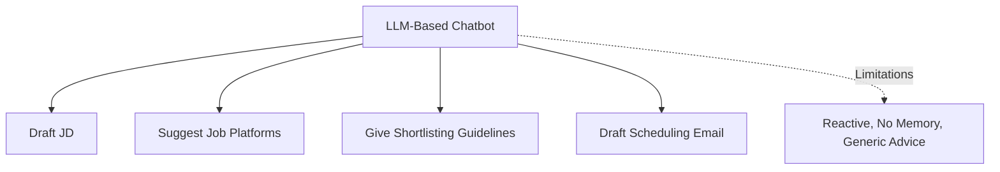
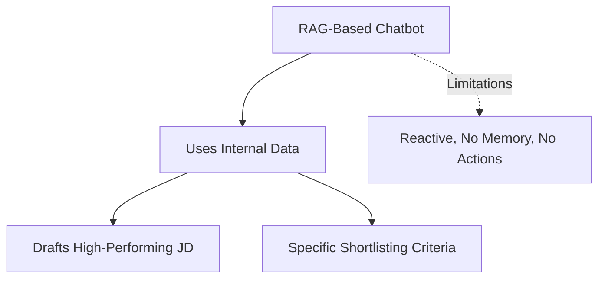
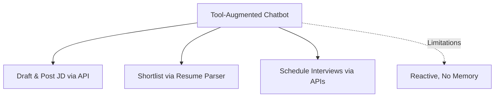
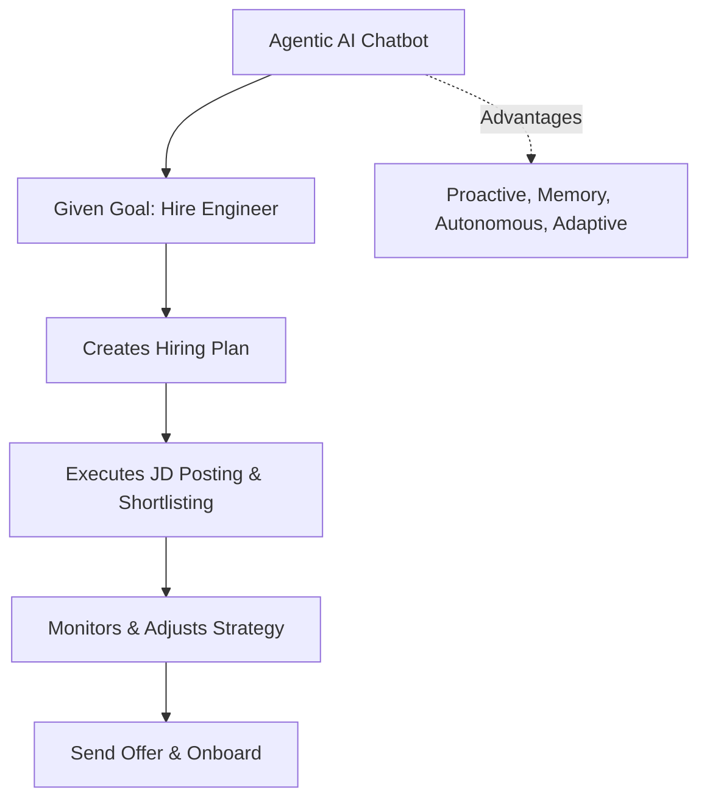
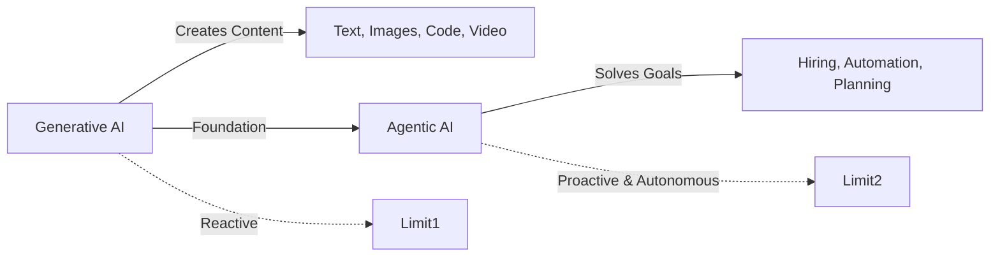

Perfect ✅ I’ll enhance your markdown with **Mermaid diagrams** so it looks professional and visually clear on GitHub or docs.

Here’s the updated file:

````markdown
# Generative AI and AI Chatbots in Hiring

## Generative AI
Generative AI refers to a class of AI models that can create new content like **text, images, audio, code, or video** that mimics human-created data.  

### Examples:
- **LLM-based apps** like ChatGPT  
- **Diffusion models** for images  
- **Code-generating LLMs** like CodeLlama  
- **Video generation models** like Sora  

### Generative AI vs. Traditional AI
```mermaid
graph TD
    A[Traditional AI] -->|Finds patterns| B[Predictions]
    C[Generative AI] -->|Learns distribution| D[Generates new samples]
````

👉 Generative AI can **mimic humans**, which is considered its best feature.

### Application Areas

* Creative and business writing
* Education
* Software development
* Design
* Customer support

---

## The Hiring Process

```mermaid
flowchart LR
    JD[Create Job Description] --> Post[Post JD on Platforms]
    Post --> Shortlist[Shortlist Candidates]
    Shortlist --> Interview[Interview Process]
    Interview --> Offer[Roll Out Offer Letter]
    Offer --> Onboard[Onboarding]
```

---

## Types of AI Chatbots in Hiring

### 1. LLM-Based Chatbot (Chatbot 1)

**Capabilities:**

* Drafts a JD (e.g., backend engineer with 2–4 years of experience)
* Suggests platforms like LinkedIn or Naukri for job postings
* Provides guidelines for shortlisting (e.g., Python, cloud experience)
* Drafts interview scheduling emails

**Problems:**

* Reactive
* Lacks memory
* Gives generic advice
* Cannot take actions



---

### 2. RAG-Based Chatbot (Chatbot 2)

**Capabilities:**

* Uses internal company data (JD templates, strategies, onboarding checklists)
* Drafts JDs based on past high-performing ones
* Suggests specific criteria for shortlisting (e.g., Python, Django, cloud)

**Problems:**

* Still reactive
* Lacks memory
* Cannot take actions



---

### 3. Tool-Augmented Chatbot (Chatbot 3)

**Enhancements:**
Equipped with tools and APIs such as:

* LinkedIn API
* Resume Parser Tool
* Calendar API
* Mail API
* HRM Access Tool

**Capabilities:**

* Drafts and posts JDs via LinkedIn API
* Shortlists candidates using resume parsing
* Schedules interviews via Mail & Calendar APIs

**Problems:**

* Still reactive
* Lacks memory



---

### 4. Agentic AI Chatbot (Chatbot 4)

**Capabilities:**
Proactive and autonomous. When given a goal (e.g., *"Hire a backend engineer"*), it can:

* Draft and post a JD on the best platforms
* Monitor the hiring pipeline and adjust strategies
* Screen candidates and schedule interviews
* Draft and send an offer letter
* Start onboarding

**Advantages:**

* Reactive **and** proactive
* Has memory
* Gives specific advice
* Can take actions
* Adapts to new information (e.g., revising JD to include full-stack candidates)



---

## Conclusion



* **Generative AI** creates content, while **Agentic AI** solves goals.
* **Generative AI** is reactive, while **Agentic AI** is proactive and autonomous.
* Generative AI is a **foundational building block** of Agentic AI.
* Generative AI is the **Capability** and Agentic AI is the **Behaviour**

