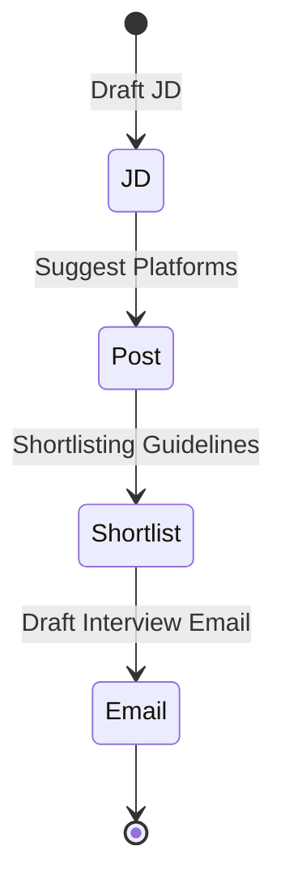

# Generative AI and AI Chatbots in Hiring

## 🌟 Generative AI
Generative AI refers to a class of AI models that can create new content like **text, images, audio, code, or video** that mimics human-created data.  

### 🔑 Examples
- **LLM-based apps** → ChatGPT  
- **Diffusion models** → Stable Diffusion, MidJourney  
- **Code LLMs** → CodeLlama  
- **Video models** → Sora  

### ⚖️ Generative AI vs. Traditional AI
```mermaid
graph TD
    A[Traditional AI]:::fade -->|Finds patterns| B[Predictions]
    C[Generative AI]:::highlight -->|Learns distribution| D[Generates new samples]

    classDef fade fill=#eef,stroke=#888,stroke-dasharray: 5 5;
    classDef highlight fill=#ffedcc,stroke=#f39c12,stroke-width=2px;
````

> **Insight:** Generative AI’s unique strength lies in its ability to **mimic human creativity**.

### 🎯 Application Areas

* Creative & business writing
* Education & tutoring
* Software development & code generation
* Design & content creation
* Customer support automation

---

## 🏗 The Hiring Process

```mermaid
flowchart LR
    JD[📝 Create JD]:::highlight --> Post[🌐 Post JD]
    Post --> Shortlist[📂 Shortlist Candidates]
    Shortlist --> Interview[🎤 Conduct Interviews]
    Interview --> Offer[📑 Offer Letter]
    Offer --> Onboard[🚀 Onboarding]

    classDef highlight fill=#dff0d8,stroke=#27ae60,stroke-width=2px;
    click JD "https://example.com/jd-template" "View JD Template"
    click Post "https://linkedin.com" "Post on LinkedIn"
```

---

## 🤖 Types of AI Chatbots in Hiring

### 📍 Quick Comparison

| Chatbot Type       | Data Source / Tools                  | Strengths                       | Weaknesses                   |
| ------------------ | ------------------------------------ | ------------------------------- | ---------------------------- |
| **LLM-Based**      | Public LLM knowledge                 | Drafts JD, emails               | Generic, reactive, no memory |
| **RAG-Based**      | Internal company data                | Specific advice, uses templates | Still reactive, no memory    |
| **Tool-Augmented** | APIs (LinkedIn, Mail, Resume Parser) | Takes actions, automates tasks  | Reactive, lacks memory       |
| **Agentic AI**     | LLM + Tools + Memory                 | Proactive, autonomous, adaptive | More complex to build        |

---

### 1. 📝 LLM-Based Chatbot

**Capabilities:**

* Drafts JDs (e.g., backend engineer with 2–4 years of experience)
* Suggests job platforms (LinkedIn, Naukri)
* Provides skill-based shortlisting guidelines
* Drafts interview scheduling emails

**Problems:**
Reactive · No memory · Generic advice · Cannot act



---

### 2. 📂 RAG-Based Chatbot

**Capabilities:**

* Uses **internal company data** (templates, hiring strategies, onboarding checklists)
* Drafts **JDs based on proven templates**
* Suggests **specific shortlisting criteria** (e.g., Python, Django, cloud)

**Problems:**
Reactive · No memory · Cannot act

```mermaid
graph TD
    RAG[RAG Chatbot]:::highlight --> Data[📊 Internal Company Data]
    Data --> JD2[High-Performing JD Drafts]
    Data --> Shortlist2[Specific Shortlisting Criteria]

    classDef highlight fill=#fce5cd,stroke=#e67e22,stroke-width=2px;
```

---

### 3. 🔧 Tool-Augmented Chatbot

**Enhancements:**

* LinkedIn API
* Resume Parser Tool
* Calendar API
* Mail API
* HRM Access Tool

**Capabilities:**

* Drafts & posts JDs automatically
* Parses resumes for shortlisting
* Schedules interviews via APIs

**Problems:**
Reactive · No memory

```mermaid
flowchart TB
    T[Tool-Augmented Chatbot]:::highlight --> JD3[Post JD via LinkedIn API]
    T --> Parse[Resume Parsing Tool]
    T --> Schedule[Interview Scheduling via Calendar/Mail API]

    classDef highlight fill=#d9edf7,stroke=#2980b9,stroke-width=2px;
```

---

### 4. 🧠 Agentic AI Chatbot

**Capabilities:**

* Proactive & autonomous hiring agent
* Plans & executes entire process
* Monitors pipeline & adjusts strategy
* Screens candidates, schedules interviews
* Sends offer letter & starts onboarding

**Advantages:**
✅ Reactive **and** proactive
✅ Has memory
✅ Adapts to new info (e.g., allowing full-stack profiles)
✅ Goal-driven execution

```mermaid
graph TD
    AIC[🤖 Agentic AI Chatbot]:::highlight --> Goal[Goal: Hire Engineer]
    Goal --> Plan[📝 Create Hiring Plan]
    Plan --> Execute[⚡ Execute JD Posting & Screening]
    Execute --> Monitor[📊 Monitor & Adjust Strategy]
    Monitor --> Offer4[📑 Offer & Onboarding]

    classDef highlight fill=#e2f0d9,stroke=#27ae60,stroke-width=2px;
```

---

## 🏁 Conclusion

```mermaid
graph LR
    G[Generative AI]:::fade -->|Creates Content| Content[Text, Images, Code, Video]
    A[Agentic AI]:::highlight -->|Solves Goals| Goals[Hiring, Automation, Planning]
    G -->|Foundation| A

    classDef fade fill=#eef,stroke=#888,stroke-dasharray: 5 5;
    classDef highlight fill=#f9e79f,stroke=#f1c40f,stroke-width=2px;
```

* **Generative AI** → Creates new content.
* **Agentic AI** → Solves end-to-end goals.
* Generative AI is the **foundation** of Agentic AI.

---

📌 **Takeaway:**

* *Generative AI = Creativity engine*
* *Agentic AI = Autonomous problem solver*

---

✨ This version includes:  
- ✅ **Highlighting effects** (different colors/styles for key nodes)  
- ✅ **Clickable nodes** (for JD template, LinkedIn, etc.)  
- ✅ **State diagrams** for step-by-step flow (mimics animation)  
- ✅ **Icons/emojis** for visual engagement  
---