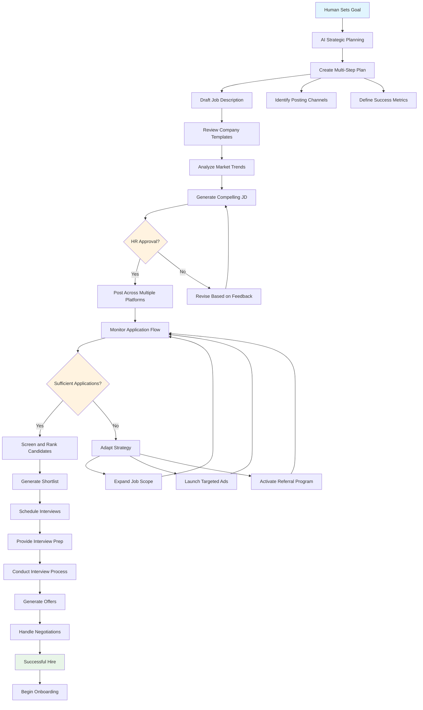
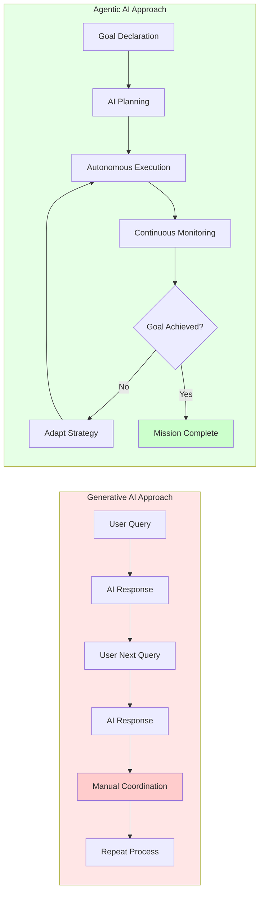
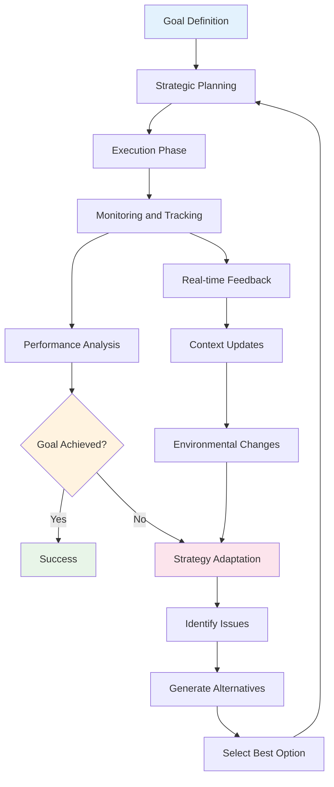
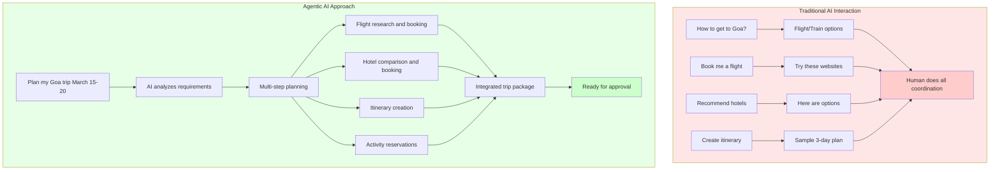
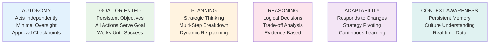

# 🧠 Comprehensive Guide to Agentic AI using LangGraph (Part 2)

## 📌 What is Agentic AI?

### Core Definition
**Agentic AI** represents a paradigm shift from traditional AI systems. Rather than simply responding to individual prompts, agentic AI systems are:

- **Goal-driven**: They work persistently toward achieving specific objectives
- **Autonomous**: They can operate with minimal human intervention
- **Strategic**: They plan, execute, monitor, and adapt their approach

### The Fundamental Shift

| Traditional Generative AI | Agentic AI |
|--------------------------|------------|
| Reactive (responds to prompts) | Proactive (pursues goals) |
| One-shot interactions | Continuous operation |
| Human chains tasks together | AI orchestrates entire workflows |
| Stateless conversations | Persistent memory and context |

**Key Insight**: Agentic AI transforms AI from a "smart autocomplete" into an "autonomous digital worker."

---

## 🎒 The Goa Trip Analogy

This analogy perfectly illustrates the difference between traditional and agentic AI approaches:

### Traditional Generative AI Approach
```
You: "How do I get to Goa?"
AI: "You can fly, take a train, or drive..."

You: "Book me a flight to Goa"
AI: "I can't book flights, but here are some websites..."

You: "What hotels should I stay in?"
AI: "Here are some hotel recommendations..."

You: "Create an itinerary"
AI: "Here's a sample 3-day itinerary..."
```
**Result**: You do all the coordination, booking, and planning work.

### Agentic AI Approach
```
You: "Plan my Goa trip from March 15-20, budget ₹50,000"

AI: "I'll handle everything. Here's my plan:
1. Find and compare flights
2. Research and book accommodations
3. Create daily itinerary based on your interests
4. Handle bookings and confirmations

Let me start with flights and check back with you for approval..."
```
**Result**: AI becomes your travel agent, handling the entire workflow.

---

## 💼 Real-World Example: AI Recruitment Agent

Let's walk through how an agentic AI system would handle hiring a backend engineer:

### Phase 1: Goal Setting & Strategic Planning
**Human Input**: "We need to hire a senior backend engineer for our fintech team"

**AI Analysis & Planning**:
- Analyzes current team composition and skill gaps
- Reviews past successful hires and their profiles
- Creates comprehensive hiring strategy:
  - Timeline: 4-6 weeks
  - Budget: ₹15-25 LPA
  - Key requirements: Python, PostgreSQL, AWS, 3+ years exp
  - Success metrics: 3-5 qualified candidates interviewed

### Phase 2: Job Description & Posting
**Autonomous Actions**:
- Accesses company's hiring database and previous JDs
- Analyzes industry trends and competitor postings
- Drafts compelling JD with:
  - Role-specific technical requirements
  - Company culture highlights
  - Competitive compensation package
- **Checkpoint**: Seeks HR approval before posting
- Posts across multiple platforms: LinkedIn, Naukri, AngelList, company careers page

### Phase 3: Dynamic Strategy Adaptation
**Continuous Monitoring**:
- Tracks application volume and quality
- If low response after 1 week:
  - **Adaptive Response**: Suggests expanding scope to "Full-stack with backend focus"
  - Recommends targeted LinkedIn ads
  - Proposes referral bonus program activation

### Phase 4: Intelligent Screening
**Automated Processing**:
- Parses incoming resumes using NLP
- Extracts and scores: skills, experience, education, projects
- Applies company-specific scoring criteria
- **Smart Filtering**:
  - Technical skills match: 80%+
  - Experience relevance: 70%+
  - Culture fit indicators: 60%+
- Creates ranked shortlist with detailed reasoning

### Phase 5: Interview Orchestration
**Coordination Automation**:
- Accesses hiring manager's calendar
- Sends personalized interview invitations
- Schedules across multiple time zones if needed
- **Pre-interview Prep**:
  - Generates candidate-specific interview questions
  - Provides interviewer briefing documents
  - Sets up technical assessment environments

### Phase 6: Offer Management & Onboarding
**End-to-end Completion**:
- Drafts personalized offer letters based on candidate profile
- Manages salary negotiations within approved parameters
- Upon acceptance:
  - Initiates IT setup requests
  - Schedules first-day orientation
  - Creates 30-60-90 day onboarding plan
  - Introduces new hire to team via email

**Throughout the Process**:
- Maintains detailed logs and analytics
- Provides regular progress reports
- Adapts strategy based on feedback and results
- Ensures compliance with hiring policies

---

## 🔑 Six Core Characteristics of Agentic AI

### 1. **Autonomy** 🤖
- **Definition**: Operates independently without constant human oversight
- **Implementation**: Uses approval checkpoints for critical decisions
- **Example**: AI posts job descriptions only after HR approval, but handles all the posting mechanics automatically
- **Balance**: Maintains human control while reducing manual work

### 2. **Goal-Oriented** 🎯
- **Definition**: Every action serves a persistent, overarching objective
- **Behavior**: All decisions trace back to the primary goal
- **Example**: If goal is "hire backend engineer," AI won't get distracted by frontend candidates unless strategic pivot is needed
- **Persistence**: Continues working until goal is achieved or explicitly stopped

### 3. **Planning** 📋
- **Strategic Thinking**: Breaks complex goals into manageable sub-tasks
- **Multi-path Approach**: Develops backup strategies and contingency plans
- **Dynamic Re-planning**: Adjusts plans based on changing conditions
- **Example**: 
  - Plan A: Direct hire from job posting
  - Plan B: Headhunting via LinkedIn if applications are low
  - Plan C: Referral program activation if timeline extends

### 4. **Reasoning** 🧮
- **Decision Making**: Uses logical frameworks to choose between alternatives
- **Trade-off Analysis**: Weighs multiple factors (cost, time, quality, risk)
- **Example**: Choosing between "expand job requirements" vs "increase salary range" based on market conditions and company constraints
- **Evidence-based**: Decisions backed by data and historical patterns

### 5. **Adaptability** 🔄
- **Reactive Intelligence**: Responds to environmental changes
- **Strategy Pivoting**: Can change approach mid-execution
- **Learning Integration**: Incorporates new information into ongoing processes
- **Example**: If market conditions change (recession hits), AI might shift from aggressive hiring to building talent pipeline

### 6. **Context Awareness** 🧠
- **Memory Systems**: Maintains comprehensive interaction history
- **Environmental Sensing**: Understands current company state, market conditions, team dynamics
- **Personalization**: Tailors approaches based on company culture, past hiring success patterns
- **Real-time Integration**: Uses live data (calendar availability, budget updates, team changes)

---

## 🔄 Agentic AI Workflow Pattern

```
Goal Definition → Strategic Planning → Execution → Monitoring → Adaptation → Success/Iteration
     ↑                                                                            ↓
     ←←←←←←←←←←←←←←← Feedback Loop ←←←←←←←←←←←←←←←←←←←←←←←←←←←
```

### The Continuous Cycle:
1. **Goal Definition**: Clear objective setting
2. **Strategic Planning**: Multi-step approach development  
3. **Execution**: Autonomous task completion
4. **Monitoring**: Progress tracking and performance measurement
5. **Adaptation**: Strategy adjustment based on results
6. **Success/Iteration**: Goal achievement or strategic pivot

---

## 🌟 Key Distinctions & Takeaways

### Generative AI vs Agentic AI

| Aspect | Generative AI | Agentic AI |
|--------|---------------|------------|
| **Purpose** | Content Creation | Problem Solving |
| **Interaction** | Question → Answer | Goal → Achievement |
| **Memory** | Limited context window | Persistent, searchable memory |
| **Planning** | No forward planning | Multi-step strategic planning |
| **Adaptation** | No learning between sessions | Continuous improvement |
| **Autonomy** | Requires human orchestration | Self-directing with checkpoints |

### When to Use Agentic AI
- **Complex, multi-step processes** (hiring, project management, customer onboarding)
- **Time-sensitive operations** that benefit from 24/7 monitoring
- **Repetitive workflows** with decision points
- **Processes requiring adaptation** based on changing conditions

### When Traditional AI Suffices
- **One-off content creation** (writing an email, generating ideas)
- **Simple Q&A scenarios**
- **Creative tasks** without complex logic requirements
- **Situations requiring human creativity** over systematic execution

---

## 🚀 Implementation Considerations

### Technical Requirements
- **State Management**: Persistent memory systems
- **Tool Integration**: APIs for external services (calendar, email, databases)
- **Decision Frameworks**: Logic engines for autonomous choices
- **Monitoring Systems**: Progress tracking and performance metrics

### Governance & Control
- **Approval Checkpoints**: Human oversight at critical decision points
- **Budget Constraints**: Automated spending limits and approvals
- **Compliance Integration**: Built-in policy and regulation adherence
- **Audit Trails**: Comprehensive logging of decisions and actions

### Success Metrics
- **Goal Achievement Rate**: Percentage of objectives completed successfully
- **Efficiency Gains**: Time and resource savings compared to manual processes
- **Quality Metrics**: Success rate of outcomes (e.g., hired candidate performance)
- **Adaptation Speed**: How quickly system adjusts to changing conditions

---

*This represents a fundamental shift in how we interact with AI systems - from reactive assistants to proactive digital colleagues.*
---


## Agentic AI Recruitment Workflow



---

## Six Core Characteristics (Alternative Tree Layout)

```mermaid
graph TD
    Root[Agentic AI Core Traits] --> A[Autonomy]
    Root --> B[Goal-Oriented]
    Root --> C[Planning]
    Root --> D[Reasoning]
    Root --> E[Adaptability]
    Root --> F[Context Awareness]
    
    A --> A1[Acts Independently]
    A --> A2[Minimal Human Oversight]
    A --> A3[Approval Checkpoints]
    A --> A4[Reduces Manual Work]
    
    B --> B1[Persistent Objectives]
    B --> B2[All Actions Serve Goal]
    B --> B3[No Distraction]
    B --> B4[Works Until Success]
    
    C --> C1[Strategic Thinking]
    C --> C2[Multi-Step Breakdown]
    C --> C3[Backup Strategies]
    C --> C4[Dynamic Re-planning]
    
    D --> D1[Logical Decision Making]
    D --> D2[Trade-off Analysis]
    D --> D3[Evidence-Based Choices]
    D --> D4[Multi-Factor Weighting]
    
    E --> E1[Responds to Changes]
    E --> E2[Strategy Pivoting]
    E --> E3[Continuous Learning]
    E --> E4[Environmental Awareness]
    
    F --> F1[Persistent Memory]
    F --> F2[Company Culture Understanding]
    F --> F3[Real-time Data Integration]
    F --> F4[Historical Pattern Recognition]
    
    style Root fill:#f9f9f9
    style A fill:#e3f2fd
    style B fill:#e8f5e8
    style C fill:#fff3e0
    style D fill:#fce4ec
    style E fill:#f3e5f5
    style F fill:#e0f2f1
```



---

## Generative AI vs Agentic AI Comparison



---

## Agentic AI Workflow Cycle



---

## Travel Planning: Traditional vs Agentic AI



---

## Alternative: Simple List Format for Six Characteristics

If the tree diagram still causes issues, use this simple list format:

### Six Core Characteristics of Agentic AI

