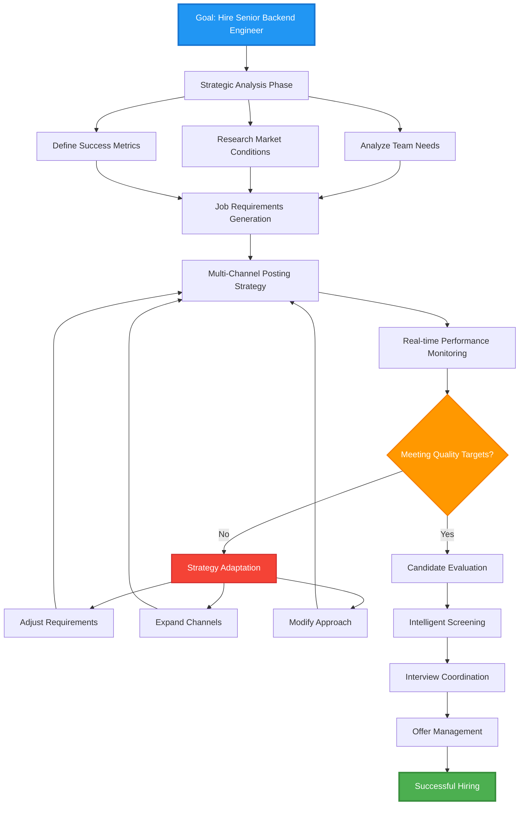
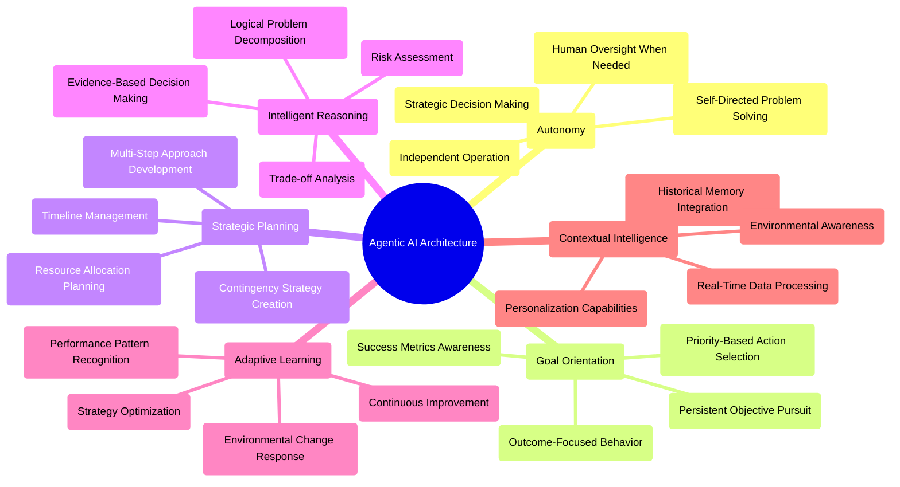
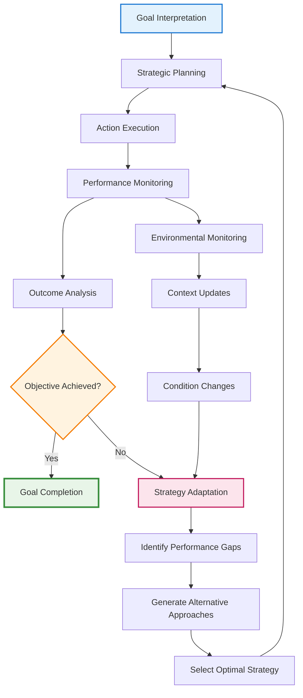
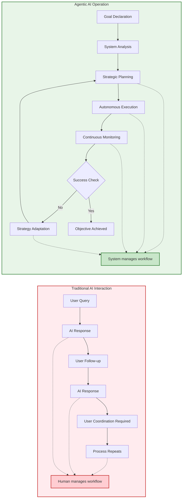

# Introduction to Agentic AI: The Next Evolution of Intelligence

> **Agentic AI** represents the fundamental shift from reactive AI tools to autonomous digital workers that pursue goals independently, think strategically, and adapt continuously.

---

## What is Agentic AI?

### Core Definition

Agentic AI systems are designed to **work toward objectives autonomously**. Unlike traditional AI that responds to individual prompts, agentic systems:

- **Understand complex, high-level goals** rather than simple tasks
- **Operate independently** with strategic thinking and decision-making
- **Plan multi-step approaches** and adapt when circumstances change  
- **Persist until completion** rather than stopping after single responses
- **Learn and improve** from outcomes and experiences

### The Fundamental Paradigm Shift

The evolution from traditional to agentic AI represents a complete reimagining of how artificial intelligence systems operate:

| Traditional Generative AI | Agentic AI |
|---------------------------|------------|
| **Reactive** → Waits for each prompt | **Proactive** → Pursues goals independently |
| **Stateless** → Forgets between interactions | **Persistent** → Maintains context and memory |
| **Task-focused** → Completes individual requests | **Goal-oriented** → Works toward broader objectives |
| **Human-orchestrated** → Requires constant guidance | **Self-directing** → Manages entire workflows |
| **One-dimensional** → Single input/output cycle | **Multi-faceted** → Complex reasoning and planning |

**Core Insight**: Agentic AI transforms artificial intelligence from a sophisticated tool into an autonomous collaborator.

---

## Understanding Through Analogy: The Travel Planning Experience

This comparison illustrates the profound difference in approaches:

### Traditional AI Experience
```
You: "How do I get to Japan?"
AI: "You can fly via Tokyo or Osaka. Here are airline options..."

You: "What about hotels?"
AI: "Here are hotel recommendations in Tokyo..."

You: "Create an itinerary."
AI: "Here's a sample 7-day Tokyo itinerary..."

You: "Book everything for me."
AI: "I cannot make bookings, but here are booking websites..."
```

**Reality**: You coordinate every step, make all decisions, handle all logistics.

### Agentic AI Experience
```
You: "Plan a cultural immersion trip to Japan for two weeks in spring, 
     budget $4000, I love art and traditional architecture."

AI: "I understand you want a culturally rich experience. Here's my approach:

1. Researching optimal timing for cherry blossoms and cultural events
2. Identifying regions that combine art museums with traditional temples
3. Finding accommodations that offer authentic experiences
4. Creating day-by-day itineraries balancing must-see sites with discovery
5. Handling all bookings and providing you with confirmation details

I'll start by analyzing spring weather patterns and cultural calendar, 
then present you with three different regional focus options for approval.
Should I proceed?"
```

**Reality**: The AI acts as your personal travel curator, handling complex coordination while keeping you informed of major decisions.

---

## Real-World Application: The Autonomous Recruitment System

Consider how agentic AI revolutionizes hiring - one of business's most complex, multi-step processes:



### What Makes This Genuinely "Agentic"

**Autonomous Decision Making**: The system decides which job boards to prioritize, how to adjust requirements based on response rates, and when to escalate decisions to humans.

**Strategic Planning**: Rather than just posting a job description, it develops comprehensive sourcing strategies with backup approaches and timeline management.

**Adaptive Intelligence**: When initial approaches don't yield quality candidates, it analyzes why and modifies its strategy rather than simply continuing ineffective methods.

**Contextual Awareness**: It considers company culture, market conditions, competitive landscape, and historical hiring success patterns in its decision-making.

**Goal Persistence**: The system continues working toward the ultimate objective (successful hire) rather than stopping at task completion (job posted).

---

## The Six Pillars of Agentic Intelligence



### Deep Dive: How These Pillars Work Together

**Autonomy** enables the system to operate without constant human intervention, making routine decisions confidently while knowing when to seek guidance.

**Goal Orientation** ensures every action serves the larger objective, preventing the system from getting distracted by interesting but irrelevant opportunities.

**Strategic Planning** allows the system to think several steps ahead, developing comprehensive approaches rather than reacting to immediate situations.

**Intelligent Reasoning** provides the foundation for making sound decisions by analyzing available information, weighing options, and considering consequences.

**Adaptive Learning** enables continuous improvement by analyzing outcomes, identifying successful patterns, and refining strategies over time.

**Contextual Intelligence** ensures decisions are informed by relevant background information, current conditions, and historical patterns.

---

## The Agentic AI Operational Cycle



### The Cycle in Action

**Goal Interpretation**: The system doesn't just accept objectives at face value but analyzes what success really means, identifies potential challenges, and establishes measurable outcomes.

**Strategic Planning**: Rather than jumping into action, the system develops comprehensive approaches, considers multiple pathways, and prepares contingency strategies.

**Action Execution**: The system takes concrete steps toward objectives while maintaining awareness of changing conditions and emerging opportunities.

**Performance Monitoring**: Continuous tracking of progress, environmental conditions, and effectiveness indicators ensures the system stays on course.

**Outcome Analysis**: The system evaluates results not just for immediate success but for lessons that inform future strategy development.

**Strategy Adaptation**: When approaches aren't working, the system doesn't simply retry the same methods but analyzes root causes and develops fundamentally different approaches.

---

## Comparing Paradigms: Traditional vs Agentic AI



### The Critical Difference

**Traditional AI**: Excels at individual tasks but requires human orchestration for complex objectives. Users must break down goals, coordinate between AI interactions, and manage the overall workflow.

**Agentic AI**: Takes responsibility for the entire objective, managing complexity internally while keeping humans informed of progress and major decisions.

---

## Implementation Considerations

### Technical Architecture Requirements

**Persistent State Management**: Unlike traditional AI's stateless interactions, agentic systems require sophisticated memory systems to track goals, progress, learned patterns, and environmental context.

**Decision Framework Integration**: Systems need structured approaches for evaluating options, assessing risks, and making autonomous choices within defined parameters.

**Real-Time Monitoring Capabilities**: Continuous assessment of progress, environmental changes, and performance metrics enables adaptive responses and strategic adjustments.

**External System Integration**: Agentic AI must interact with calendars, databases, APIs, and other tools to take concrete actions in the real world.

**Human Oversight Mechanisms**: Clear escalation pathways, approval checkpoints, and override capabilities ensure appropriate human control over autonomous operations.

### Governance and Control

**Approval Workflows**: Critical decisions and high-stakes actions require human review and approval before execution.

**Constraint Management**: Systems operate within defined boundaries regarding budget, timeline, risk tolerance, and strategic approach.

**Audit Trail Generation**: Comprehensive logging of decisions, reasoning, and actions enables transparency, debugging, and compliance.

**Performance Measurement**: Clear metrics and success criteria allow for objective evaluation of system effectiveness and continuous improvement.

---

## When to Deploy Agentic AI

### Ideal Use Cases

**Complex, Multi-Step Processes**: Scenarios involving multiple decision points, coordination requirements, and extended timelines benefit significantly from agentic approaches.

**Dynamic Environment Management**: Situations where conditions change frequently and strategies must adapt accordingly are natural fits for agentic systems.

**Resource Optimization**: Tasks involving allocation decisions, scheduling coordination, and efficiency maximization leverage agentic AI's strategic planning capabilities.

**Relationship Management**: Long-term interactions requiring context awareness, personalization, and adaptive communication strategies benefit from agentic approaches.

### When Traditional AI Remains Superior

**Creative Generation**: Original content creation, artistic endeavors, and innovative ideation still benefit from human creativity with AI assistance.

**One-Time Tasks**: Simple, isolated requests without ongoing requirements don't justify agentic system complexity.

**High-Stakes Decisions**: Critical business choices, legal determinations, and ethical judgments require human wisdom and accountability.

**Exploratory Analysis**: Open-ended research and discovery often benefit from human intuition and creative problem-solving approaches.

---

## The Future of Agentic Intelligence

### Emerging Capabilities

**Multi-Agent Collaboration**: Future systems will coordinate multiple specialized agents, each contributing expertise toward complex shared objectives.

**Cross-Domain Learning**: Agentic systems will apply successful strategies from one domain to solve problems in completely different areas.

**Predictive Adaptation**: Advanced systems will anticipate changes and proactively adjust strategies before current approaches become ineffective.

**Human-AI Symbiosis**: The most effective implementations will seamlessly blend human creativity and judgment with AI's systematic execution and continuous operation.

### Implications for Organizations

**Workforce Evolution**: Roles will shift toward strategy, creativity, and oversight as agentic systems handle routine execution and coordination.

**Competitive Advantage**: Organizations effectively deploying agentic AI will achieve significant advantages in efficiency, consistency, and scalability.

**New Skill Requirements**: Success will require understanding how to collaborate with autonomous systems rather than simply using AI tools.

**Ethical Considerations**: As systems become more autonomous, questions of accountability, bias, and control become increasingly important.

---

## Key Takeaways

**Fundamental Shift**: Agentic AI represents evolution from reactive tools to autonomous collaborators that share objectives and work independently toward their achievement.

**Strategic Thinking**: These systems don't just execute tasks but develop comprehensive approaches, consider alternatives, and adapt strategies based on outcomes.

**Persistent Operation**: Unlike traditional AI's discrete interactions, agentic systems maintain context, track progress, and continue working until objectives are achieved.

**Human Partnership**: The goal isn't to replace human decision-making but to handle the routine, repetitive, and time-intensive aspects of goal achievement while keeping humans involved in strategy and oversight.

**Transformative Potential**: Organizations mastering agentic AI collaboration will gain significant advantages in productivity, consistency, and ability to handle complex, ongoing challenges.

The transition to agentic AI isn't just about better technology - it represents a new paradigm for human-computer collaboration that will reshape how we approach complex objectives in business, research, and society.