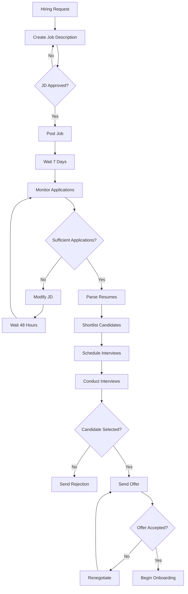

# LangChain vs LangGraph: Complete Guide to Agentic AI Development

> **Course Context**: Third video in "Agentic AI using LangGraph" series  
> **Prerequisites**: Basic LangChain knowledge, understanding of LLM applications  
> **Duration**: Comprehensive deep-dive into architectural differences

---

## 🎯 Learning Objectives

By the end of this guide, you will:
- [ ] Understand why LangGraph was created and what problems it solves
- [ ] Distinguish between workflows and agents in AI systems
- [ ] Identify when to use LangChain vs LangGraph for different project types
- [ ] Master the 8 critical challenges that LangGraph addresses

---

## 📚 LangChain Foundation Review

### Core Definition
**LangChain** is an open-source library designed to simplify building LLM-based applications by providing modular building blocks and orchestration capabilities.

### Essential Components

| Component | Purpose | Key Features |
|-----------|---------|--------------|
| **Models** | Unified LLM interface | Support for OpenAI, Anthropic, Hugging Face, Ollama |
| **Prompts** | Prompt engineering tools | Templates, few-shot examples, dynamic generation |
| **Retrievers** | Knowledge base integration | Vector store queries, document fetching |
| **Chains** | Component orchestration | Sequential processing, data flow management |

### LangChain Use Cases

#### ✅ Ideal For:
- **Simple conversational workflows**: Chatbots, Q&A systems
- **Linear multi-step processes**: Document summarization pipelines
- **Basic RAG applications**: Knowledge base querying
- **Straightforward prompt chains**: Template-based interactions

#### ⚠️ Challenges With:
- Complex decision trees
- Long-running processes
- State-dependent workflows
- Multi-agent coordination

---

## 🏗️ Understanding Complex Workflows

### Workflow vs Agent Distinction

> **Critical Concept**: Not all AI systems are agents. Understanding this difference is fundamental.

| Aspect | **Workflows** | **Agents** |
|--------|---------------|------------|
| **Control** | Predefined code paths | Dynamic self-direction |
| **Planning** | Developer-defined steps | AI-generated strategies |
| **Flexibility** | Static execution order | Adaptive decision-making |
| **Example** | Recipe following | Creative problem solving |

### Case Study: Automated Hiring System

#### System Overview
A production-grade hiring automation system demonstrating complex workflow requirements:



#### Key Complexity Indicators
- **Conditional branches**: 4+ decision points
- **Loops**: Multiple retry mechanisms
- **Wait states**: 7-day and 48-hour delays
- **Human interaction**: Approval gates
- **External dependencies**: Job platforms, email systems

---

## ⚡ The 8 Critical Challenges

### 1. Control Flow Complexity

#### The Problem
LangChain excels at linear chains but struggles with complex control structures:

```python
# LangChain approach - requires manual orchestration
approved = False
while not approved:
    jd = jd_chain.invoke(hiring_request)
    approved = approval_function(jd)
    
if approved:
    post_function(jd)
```

#### LangGraph Solution
```python
# LangGraph approach - declarative flow
graph.add_conditional_edges(
    "check_approval",
    approve_condition,
    {
        "approved": "post_jd",
        "rejected": "create_jd"
    }
)
```

**Result**: Zero glue code, maintainable architecture

---

### 2. State Management

#### Understanding State
**State** = Collection of data points that evolve throughout workflow execution

| Data Point | Initial Value | Evolution |
|------------|---------------|-----------|
| `job_description` | `None` | Set after JD creation |
| `is_approved` | `False` | Updated during approval |
| `application_count` | `0` | Incremented as applications arrive |
| `shortlisted_candidates` | `[]` | Populated during screening |

#### The Challenge
- **LangChain**: Manual state management through global variables
- **LangGraph**: Built-in stateful execution with automatic state passing

```python
# LangGraph state definition
class HiringState(TypedDict):
    job_description: str
    is_approved: bool
    application_count: int
    shortlisted_candidates: List[dict]
```

---

### 3. Event-Driven Execution

#### Sequential vs Event-Driven

| Model | Characteristics | Best For |
|-------|-----------------|----------|
| **Sequential** | Continuous execution, no pauses | Simple transformations |
| **Event-Driven** | Pause/resume capability | Real-world processes |

#### Real-World Requirements
- Wait 7 days for job applications
- Pause for human approval (indefinite duration)
- Resume after external triggers

#### LangGraph Advantages
- **Checkpointing**: Save exact execution state
- **Resume capability**: Continue from any point
- **Asynchronous support**: Handle external events naturally

---

### 4. Fault Tolerance

#### Types of Failures

| Failure Type | Examples | Impact |
|--------------|----------|---------|
| **Transient** | API timeouts, network glitches | Temporary disruption |
| **System** | Server crashes, container failures | Complete workflow halt |

#### LangGraph Recovery Mechanisms

1. **Retry Logic**
   ```python
   @retry(max_attempts=3, backoff_strategy="exponential")
   def post_to_linkedin(jd):
       # API call with automatic retry
   ```

2. **State Recovery**
   ```python
   # Resume from last checkpoint
   graph.resume(checkpoint_id="hiring_workflow_123")
   ```

---

### 5. Human-in-the-Loop

#### Business Requirements
- JD approval before posting
- Interview feedback collection  
- Final hiring authorization

#### Implementation Challenges
- **Duration**: Approvals may take hours or days
- **Asynchronous**: Non-blocking workflow execution
- **Context preservation**: Maintain state during pauses

#### LangGraph Features
```python
# Pause for human input
def approval_node(state):
    return {"pending_approval": True}

# Resume after human decision
graph.resume_after_human_input(
    input_type="approval",
    timeout=None  # Wait indefinitely
)
```

---

### 6. Nested Workflows (Subgraphs)

#### Concept
Graphs within graphs - modular, reusable workflow components

#### Use Cases

1. **Modularity**
   ```
   Main Workflow
   ├── Interview Subgraph
   │   ├── Generate Questions
   │   ├── Conduct Round 1
   │   ├── Evaluate Responses
   │   └── Make Decision
   └── Onboarding Subgraph
   ```

2. **Multi-Agent Systems**
   - Sensor Processing Agent
   - Decision Making Agent
   - Execution Agent
   - Coordination Agent

#### Benefits
- **Reusability**: Same approval flow used multiple times
- **Maintainability**: Isolated, testable components
- **Scalability**: Complex systems from simple building blocks

---

### 7. Observability & Monitoring

#### Why Critical?
- **Production debugging**: Understand failures in real-time
- **Auditing**: Track decision-making processes
- **Optimization**: Identify bottlenecks and improvements

#### LangChain Limitations
- **Partial visibility**: Only LangChain components tracked
- **Glue code blindness**: Custom Python code not monitored
- **Limited context**: Difficult to trace complex flows

#### LangGraph + LangSmith Integration
- **Complete timeline**: Every node execution tracked
- **State evolution**: See data changes at each step
- **Human interactions**: Record all approval decisions
- **Error tracing**: Full context for debugging

---

## 🎛️ Decision Framework: When to Use What?

### Use LangChain When:

| Scenario | Characteristics | Examples |
|----------|-----------------|----------|
| **Simple Pipelines** | Linear, predictable flow | Document summarization |
| **Prototype Development** | Quick iteration, basic functionality | POC chatbots |
| **Component Integration** | Using existing LangChain tools | RAG with standard retrievers |

### Use LangGraph When:

| Scenario | Characteristics | Examples |
|----------|-----------------|----------|
| **Complex Logic** | Branching, looping, conditions | Multi-step approval processes |
| **Production Systems** | Reliability, monitoring, scale | Enterprise automation |
| **Multi-Agent** | Coordinated AI systems | Autonomous vehicles, trading systems |
| **Human Collaboration** | Mixed AI-human workflows | Content creation pipelines |

---

## 🔄 Architecture Comparison

### LangChain Architecture
```
Input → Component A → Component B → Component C → Output
         ↑                                      
    Manual orchestration required
```

**Characteristics:**
- Component-centric design
- Manual state management
- Linear execution model
- Limited error handling

### LangGraph Architecture
```
     ┌─────────────┐
     │   State     │
     │ Management  │
     └─────────────┘
           │
    ┌──────┴──────┐
    │    Graph    │
    │ Orchestrator│
    └─────────────┘
           │
    Nodes connected by smart edges
```

**Characteristics:**
- Graph-centric design
- Automatic state management
- Event-driven execution
- Built-in fault tolerance

---

## 💡 Key Insights & Best Practices

### 1. Complementary Technologies
> **Remember**: LangGraph builds **on top of** LangChain, not instead of it

- Continue using LangChain components (models, prompts, tools)
- Use LangGraph for orchestration and complex flows
- Combine both for production applications

### 2. Migration Strategy
1. **Assessment**: Identify workflow complexity
2. **Gradual adoption**: Start with LangGraph for new complex features
3. **Component reuse**: Leverage existing LangChain investments
4. **Team training**: Build LangGraph expertise incrementally

### 3. Production Considerations
- **Monitoring**: Implement comprehensive observability
- **Testing**: Unit test individual nodes, integration test flows
- **Deployment**: Use checkpointing for reliability
- **Scaling**: Design for horizontal scaling needs

---

## 📈 Future Learning Path

### Immediate Next Steps
- [ ] Set up LangGraph development environment
- [ ] Build first simple graph with state management
- [ ] Implement human-in-the-loop example
- [ ] Practice with conditional branching

### Advanced Topics
- [ ] Multi-agent system design
- [ ] Production deployment strategies  
- [ ] Performance optimization techniques
- [ ] Integration with external systems

### Mastery Indicators
- [ ] Can choose appropriate framework for any given problem
- [ ] Understand trade-offs between different architectures
- [ ] Can design complex, maintainable AI workflows
- [ ] Proficient in debugging and monitoring techniques

---

## 🔗 Additional Resources

### Documentation
- [LangGraph Official Docs](https://langchain-ai.github.io/langgraph/)
- [LangChain Documentation](https://python.langchain.com/)
- [LangSmith Observability](https://docs.smith.langchain.com/)

### Community
- [LangChain Discord](https://discord.gg/langchain)
- [GitHub Repositories](https://github.com/langchain-ai)
- [Community Examples](https://github.com/langchain-ai/langgraph/tree/main/examples)

---

