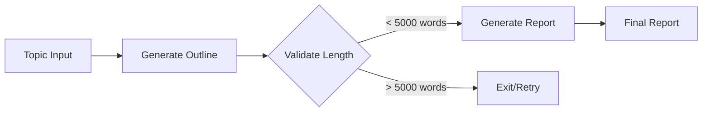
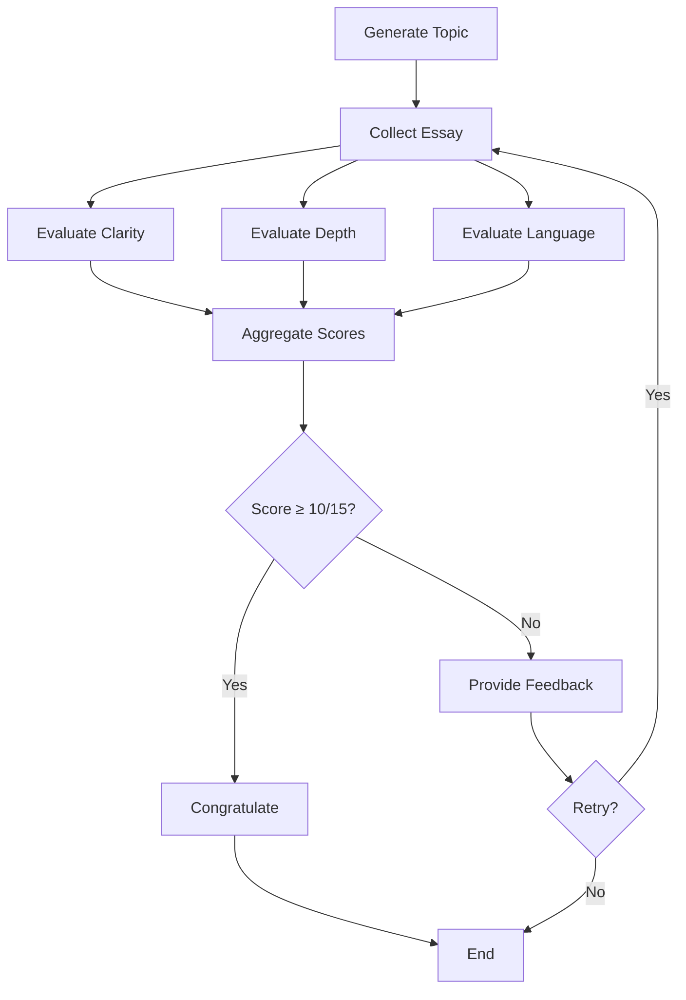
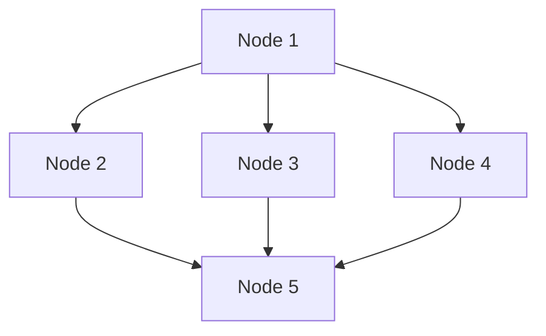

# LangGraph Core Concepts: Mastering Agentic AI Development

> **Course Context**: Fourth video in "Agentic AI using LangGraph" series  
> **Prerequisites**: Understanding of LangChain vs LangGraph differences (previous video)  
> **Focus**: Deep-dive into LangGraph's fundamental concepts and building blocks

---

## 🎯 Learning Objectives

By the end of this guide, you will:
- [ ] Master LangGraph's core concepts and building blocks
- [ ] Understand different types of LLM workflows and their applications
- [ ] Learn how graphs, nodes, and edges work together
- [ ] Master state management and reducers
- [ ] Understand LangGraph's execution model

---

## 🔄 What is LangGraph? (Quick Revision)

### Core Definition
**LangGraph** is an **orchestration framework** that enables you to build intelligent, stateful, and multi-step LLM workflows.

### How LangGraph Works

1. **Graph Representation**: Takes any LLM workflow and represents it as a graph
2. **Node-Task Mapping**: Each node in the graph represents a single task in your workflow
3. **Edge-Flow Control**: Edges between nodes define the execution flow and order
4. **Automated Execution**: Once triggered, nodes execute automatically in the correct sequence

### Key Capabilities

| Feature | Description | Benefit |
|---------|-------------|---------|
| **Parallel Execution** | Multiple tasks can run simultaneously | Improved performance |
| **Loops** | Support for iterative processes | Handle retry logic |
| **Branching** | Conditional execution paths | Dynamic decision making |
| **Memory** | Conversation and state tracking | Context awareness |
| **Resumability** | Recovery from failures | Production reliability |

> **Key Insight**: Think of LangGraph as a "flowchart engine for LLMs" - you define the steps and logic, LangGraph handles the execution.

---

## 📋 LLM Workflows: Foundation Concepts

### What is a Workflow?

**Definition**: A workflow is a **series of tasks** executed **in order** to **achieve a goal**.

### What Makes an LLM Workflow?

An LLM workflow is any workflow where multiple tasks depend on or utilize LLMs for execution.

**Examples of LLM-dependent tasks**:
- Content generation (JD writing, essay creation)
- Analysis and evaluation (resume scoring, content moderation)
- Decision making (routing, classification)
- Reasoning and planning (task breakdown, strategy formation)

### Common LLM Workflow Patterns

Understanding these patterns is crucial as they appear repeatedly across different applications:

---

## 1️⃣ Prompt Chaining

### Concept
Sequential LLM calls where each output becomes input for the next stage.

### Structure
```
Topic → [Generate Outline] → Outline → [Write Report] → Final Report
```

### Use Cases
- **Report Generation**: Topic → Outline → Detailed Report
- **Content Creation**: Idea → Structure → Full Article
- **Multi-step Analysis**: Raw Data → Summary → Insights → Recommendations

### Benefits
- **Modularity**: Break complex tasks into manageable steps
- **Quality Control**: Validate intermediate outputs
- **Debugging**: Isolate issues to specific stages

### Example: Academic Report Generator


---

## 2️⃣ Routing

### Concept
Intelligent task distribution based on content analysis and classification.

### Structure
```
Query → [Classifier LLM] → Route to → [Specialized LLM]
```

### Use Cases
- **Customer Support**: Route queries to appropriate specialists
- **Content Moderation**: Direct content to relevant checkers
- **Multi-domain Systems**: Channel requests to domain experts

### Example: Customer Support Router

| Query Type | Routing Destination | Specialization |
|------------|-------------------|----------------|
| Refund requests | Billing LLM | Financial processes |
| Technical issues | Support LLM | Product troubleshooting |
| Sales inquiries | Sales LLM | Product information |

### Implementation Pattern
1. **Analyze**: Classify incoming request
2. **Route**: Direct to appropriate specialized LLM
3. **Process**: Handle with domain-specific expertise
4. **Respond**: Return targeted solution

---

## 3️⃣ Parallelization

### Concept
Break down tasks into independent sub-tasks that can be executed simultaneously.

### Structure
```
Task → [Sub-task 1] → Results
     → [Sub-task 2] → Aggregator → Final Result  
     → [Sub-task 3] → 
```

### Use Cases
- **Content Moderation**: Simultaneous checks for different violation types
- **Multi-perspective Analysis**: Parallel evaluation from different angles
- **Batch Processing**: Handle multiple similar tasks concurrently

### Example: YouTube Content Moderation

| Parallel Check | Focus Area | Output |
|----------------|------------|---------|
| Community Guidelines | Policy violations | Pass/Fail + Reason |
| Misinformation Detection | Factual accuracy | Confidence score |
| Adult Content Scanner | Inappropriate material | Risk level |

**Aggregation Logic**: All checks must pass for content approval

### Benefits
- **Speed**: Faster processing through parallelism
- **Thoroughness**: Multiple specialized evaluations
- **Scalability**: Easy to add new evaluation criteria

---

## 4️⃣ Orchestrator-Worker

### Concept
Dynamic task assignment where the orchestrator analyzes input and assigns different tasks to workers based on context.

### Key Difference from Parallelization
- **Parallelization**: Pre-defined, static task distribution
- **Orchestrator-Worker**: Dynamic, context-dependent task assignment

### Use Cases
- **Research Assistant**: Different search strategies based on query type
- **Content Generation**: Different approaches based on content type
- **Analysis Systems**: Different analytical methods based on data type

### Example: Intelligent Research Assistant

**Input Analysis**:
- Scientific topic → Search academic databases (Google Scholar)
- Current events → Search news sources (Google News)  
- Historical data → Search archives and references

**Dynamic Assignment**:
```python
# Pseudo-logic
if topic.is_scientific():
    assign_worker("academic_searcher", platforms=["scholar", "pubmed"])
elif topic.is_current_event():
    assign_worker("news_searcher", platforms=["news_api", "twitter"])
else:
    assign_worker("general_searcher", platforms=["google", "wikipedia"])
```

---

## 5️⃣ Evaluator-Optimizer

### Concept
Iterative improvement through evaluation and feedback loops.

### Structure
```
Task → [Generator] → Solution → [Evaluator] → Feedback
  ↑                                              ↓
  ← ← ← ← ← ← ← ← [Improve] ← ← ← ← ← ← ← ← ← ←
```

### Use Cases
- **Creative Writing**: Iterative story/poem improvement
- **Code Generation**: Code quality enhancement through review cycles
- **Content Optimization**: Marketing copy refinement

### Components

| Component | Role | Responsibilities |
|-----------|------|------------------|
| **Generator** | Creates initial solution | Content creation based on requirements |
| **Evaluator** | Assesses quality | Scoring against defined criteria |
| **Feedback Loop** | Drives improvement | Provides specific improvement suggestions |

### Example: Email Draft Optimizer

**Evaluation Criteria**:
- Clarity and conciseness
- Tone appropriateness
- Grammar and style
- Call-to-action effectiveness

**Process Flow**:
1. Generate initial email draft
2. Evaluate against criteria (score /10)
3. If score < 7: Provide feedback and regenerate
4. If score ≥ 7: Accept and finalize
5. Track iterations for quality monitoring

---

## 🕸️ Graphs, Nodes, and Edges: The Core Architecture

Understanding how LangGraph represents workflows as graphs is fundamental to mastering the framework.

### Real-World Example: UPSC Essay Practice Platform

Let's build understanding through a concrete example - a web platform that helps UPSC aspirants practice essay writing.

#### System Requirements
- Generate essay topics for practice
- Collect student essays
- Multi-perspective evaluation (clarity, depth, language)
- Scoring and feedback
- Iterative improvement cycle

#### Graph Representation



### Understanding Nodes

#### What are Nodes?
- Each node represents a **single task** in your workflow
- Behind the scenes, every node is a **Python function**
- Nodes are the "workers" that perform actual operations

#### Types of Tasks Nodes Can Perform
- **LLM Calls**: Generate content, analyze text
- **Tool Calls**: API requests, database operations
- **Decision Making**: Branching logic, routing
- **Data Processing**: Transformations, validations

### Understanding Edges

#### What are Edges?
Edges define the **flow of execution** - they determine which node executes after the current node completes.

#### Types of Edges

| Edge Type | Description | Use Case |
|-----------|-------------|----------|
| **Sequential** | Direct 1→2→3 flow | Linear processing |
| **Parallel** | 1→2,3,4 simultaneous | Independent tasks |
| **Conditional** | Branch based on logic | Decision points |
| **Loop** | Return to previous nodes | Retry mechanisms |

### Key Insights

1. **Nodes = What to do** (The tasks)
2. **Edges = When to do it** (The control flow)
3. **Graph = Complete workflow representation**

#### Benefits of Graph Structure
- **Flexibility**: Express complex flows naturally
- **Clarity**: Visual representation of logic
- **Reusability**: Modular node design
- **Debugging**: Isolate issues to specific nodes

---

## 🗂️ State: The Memory of Your Workflow

State is arguably the most important concept in LangGraph - it's what makes complex, stateful workflows possible.

### What is State?

**Definition**: State is the **shared memory** that flows through your workflow, holding all data being passed between nodes as your graph runs.

### State Characteristics

1. **Required for Execution**: Workflow needs this data to function
2. **Evolves Over Time**: Changes as workflow progresses  
3. **Shared**: Accessible to all nodes
4. **Mutable**: Nodes can modify state values

### State in Our UPSC Example

#### Key Data Points
```python
class UPSCState(TypedDict):
    topic: str              # Generated essay topic
    essay_text: str         # Student's essay content
    clarity_score: float    # Score for clarity (0-5)
    depth_score: float      # Score for analysis depth (0-5)
    language_score: float   # Score for language quality (0-5)
    total_score: float      # Aggregated score
    feedback: str           # Improvement suggestions
    retry_count: int        # Number of attempts
```

### How State Flows Through Nodes

#### State Evolution Example
```python
# Initial state (when workflow starts)
{
    "topic": None,
    "essay_text": None,
    "clarity_score": 0,
    "depth_score": 0,
    "language_score": 0,
    "total_score": 0,
    "feedback": "",
    "retry_count": 0
}

# After topic generation
{
    "topic": "Role of Technology in Modern Education",
    # ... other fields unchanged
}

# After essay evaluation
{
    "topic": "Role of Technology in Modern Education",
    "essay_text": "Education has transformed...",
    "clarity_score": 3.5,
    "depth_score": 4.0,
    "language_score": 3.0,
    "total_score": 10.5,
    # ... rest updated accordingly
}
```

### State Management Principles

#### 1. Accessibility
Every node receives the **complete state** as input and can read any field.

#### 2. Mutability  
Nodes can modify state fields and pass the updated state to the next node.

#### 3. Automatic Passing
LangGraph automatically handles state transfer between nodes - no manual intervention required.

### Technical Implementation

State is implemented as a **TypedDict** in Python:

```python
from typing import TypedDict
from typing_extensions import Annotated

class WorkflowState(TypedDict):
    field1: str
    field2: int
    field3: List[str]
    # ... additional fields
```

---

## ⚙️ Reducers: Controlling State Updates

Reducers determine **how** state updates are applied when nodes modify shared data.

### The Problem Reducers Solve

By default, when a node updates a state field, it **replaces** the previous value. But sometimes you want different update behaviors.

### Update Strategies

| Strategy | Behavior | When to Use |
|----------|----------|-------------|
| **Replace** | New value overwrites old | Default behavior, single values |
| **Add/Append** | New value added to existing | Lists, conversation history |
| **Merge** | Combine old and new values | Dictionaries, complex objects |

### Example: The Problem with Default Behavior

#### Scenario: Simple Chatbot
```python
class ChatState(TypedDict):
    messages: str

# Execution flow
# Human: "Hi, my name is Nitesh"
state = {"messages": "Hi, my name is Nitesh"}

# LLM: "Hi! How can I help you?"  
state = {"messages": "Hi! How can I help you?"}  # Previous message lost!

# Human: "Can you tell me my name?"
state = {"messages": "Can you tell me my name?"}  # Context completely lost!
```

**Problem**: The LLM cannot answer because previous context was overwritten.

### Solution: Using Reducers

#### For Conversation History
```python
from langgraph.graph.message import add_messages

class ChatState(TypedDict):
    messages: Annotated[List[str], add_messages]  # Use add reducer
```

**Result**: Messages accumulate instead of replacing:
```python
# After full conversation
state = {
    "messages": [
        "Hi, my name is Nitesh",
        "Hi! How can I help you?", 
        "Can you tell me my name?"
    ]
}
```

### Practical Applications

#### 1. Essay Revision Tracking
```python
class EssayState(TypedDict):
    essay_versions: Annotated[List[str], add_messages]  # Keep all versions
    current_score: float  # Replace with latest score
```

#### 2. Parallel Processing Results
```python
def merge_scores(existing: dict, new: dict) -> dict:
    """Custom reducer for combining parallel evaluation results"""
    return {**existing, **new}

class EvaluationState(TypedDict):
    scores: Annotated[Dict[str, float], merge_scores]
```

### Key Insights

1. **Default = Replace**: Most fields use replacement behavior
2. **Choose Wisely**: Select reducer based on data semantics
3. **Custom Reducers**: Create specialized merge logic when needed
4. **Per-Field Control**: Each state field can have its own reducer

---

## 🔧 LangGraph Execution Model

Understanding how LangGraph executes workflows behind the scenes helps with debugging and optimization.

### Inspiration: Google Pregel

LangGraph's execution model is inspired by **Google Pregel** - a system for large-scale graph processing used across Google's products.

### Execution Phases

#### 1. Graph Definition Phase
```python
# Define nodes, edges, and state
graph = StateGraph(MyState)
graph.add_node("node1", function1)
graph.add_node("node2", function2)
graph.add_edge("node1", "node2")
```

#### 2. Compilation Phase
```python
# Validate graph structure and optimize
compiled_graph = graph.compile()
```

**Compilation checks**:
- No orphaned nodes (disconnected components)
- Valid edge connections
- State schema consistency
- Circular dependency detection

#### 3. Execution Phase
```python
# Trigger workflow execution
result = compiled_graph.invoke(initial_state)
```

### The SuperStep Model

#### What is a SuperStep?
A **SuperStep** is a round of execution where one or more nodes can execute in parallel.

#### Why "SuperStep" and not "Step"?


In the above graph:
- **SuperStep 1**: Only Node 1 executes
- **SuperStep 2**: Nodes 2, 3, and 4 execute **simultaneously**
- **SuperStep 3**: Node 5 executes

Since multiple nodes can execute in parallel within a single "step," LangGraph calls it a "SuperStep."

### Message Passing Mechanism

#### How State Flows
1. **Node Activation**: Node receives current state as input
2. **Processing**: Node executes its Python function
3. **State Update**: Node modifies relevant state fields
4. **Message Passing**: Updated state sent to next node(s) via edges
5. **Repeat**: Process continues until no more active nodes

#### Termination Conditions
Workflow stops when:
- No active nodes remain
- No messages being passed through edges
- Explicit termination condition met

### Execution Flow Example

```python
# SuperStep 1: Initial invocation
invoke_node("generate_topic", initial_state)
# State: {"topic": "AI in Education", ...}

# SuperStep 2: Sequential processing  
invoke_node("collect_essay", updated_state)
# State: {"topic": "AI in Education", "essay": "...", ...}

# SuperStep 3: Parallel evaluation
parallel_invoke([
    ("evaluate_clarity", state),
    ("evaluate_depth", state), 
    ("evaluate_language", state)
])
# State: All scores updated simultaneously

# SuperStep 4: Aggregation
invoke_node("aggregate_scores", final_state)
# Workflow continues until termination...
```

### Key Insights

1. **Automatic Orchestration**: No manual node invocation required
2. **Parallel Optimization**: LangGraph automatically parallelizes where possible
3. **State Consistency**: Message passing ensures data integrity
4. **Fault Tolerance**: SuperStep model enables recovery and resumption

---

## 📚 Summary: Core Concepts Mastery

### Essential Building Blocks

| Concept | Purpose | Key Insight |
|---------|---------|-------------|
| **Workflows** | Task sequences for goals | Foundation of all LLM applications |
| **Graphs** | Visual workflow representation | Nodes = tasks, Edges = flow control |
| **State** | Shared workflow memory | Evolves through execution, accessible to all nodes |
| **Reducers** | State update strategies | Control how data changes accumulate |
| **Execution Model** | Behind-the-scenes processing | SuperSteps enable parallel optimization |

### Workflow Pattern Library

Master these five patterns for 80% of use cases:
1. **Prompt Chaining** → Sequential processing
2. **Routing** → Intelligent task distribution  
3. **Parallelization** → Simultaneous independent tasks
4. **Orchestrator-Worker** → Dynamic task assignment
5. **Evaluator-Optimizer** → Iterative improvement cycles

### Implementation Readiness Checklist

- [ ] Can identify workflow type from requirements
- [ ] Understand when to use each reducer strategy
- [ ] Know how state flows through graph execution
- [ ] Recognize parallel execution opportunities
- [ ] Appreciate SuperStep model benefits

---

## 🔗 Next Steps

### Immediate Practice
- [ ] Design your first workflow on paper
- [ ] Identify required state fields for a use case
- [ ] Map a real problem to one of the five workflow patterns

### Upcoming Skills
- [ ] Hands-on LangGraph coding
- [ ] Building actual workflows with these concepts
- [ ] Advanced features like checkpointing and human-in-the-loop
- [ ] Production deployment strategies

---

